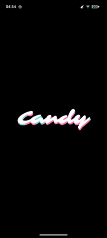

# FlowRibbon: Hypnotic AGSL Shader


## Overview

**FlowRibbon** is a visually customizable [Android Graphics Shading Language (AGSL)](https://developer.android.com/develop/ui/views/graphics/agsl) shader designed for modern Android applications (Jetpack Compose).

This shader generates an effect of **smooth, fluid, and concentric rings** that glide and warp across the screen. It is characterized by its high-contrast, "neon" aesthetic, which makes it perfect for dynamic wallpapers, captivating loading screens, or interactive backgrounds.

The effect is achieved by combining sophisticated wave-based distortion with high-contrast reflection logic, all while keeping the micro-detail low to emphasize smooth, flowing curves.

## Features

* **Fluid Distortion:** Utilizes trigonometric functions (sin/cos) for smooth, wave-like movement, free from high-frequency noise.
* **High Contrast Neon Look:** Achieved via strong Gamma correction and controlled highlight mixing.
* **Full Customization:** Control all aspects of the animation and look through a set of uniform parameters.
* **Optimized for Compose:** Built to be directly integrated into a Jetpack Compose `Canvas` element via `RuntimeShader`.


--

| Render Demo I | Debug composition | Render Demo II |  Text render | 
|:---:|:---:|:---:|:---:|
|  |  |   |   |


---


## Technical Details (AGSL Code Snippet)

The core visual effect relies on the `ultimateDistortion` function, which, when set with low `u_MicroStrength`, creates the distinct smooth ribbon appearance.

```glsl
// Déformation liquide (Core Logic)
float2 ultimateDistortion(float2 uv, float t) {
    // ... Rotation logic ...

    // Ondes principales (creates the ribbon effect)
    float waveX = sin(rotUV.x * 4.0 + t * 0.5 * u_TimeSpeed) + 0.25 * sin(rotUV.y * 6.0 - t * 0.3 * u_TimeSpeed);
    float waveY = cos(rotUV.y * 5.0 - t * 0.4 * u_TimeSpeed) + 0.25 * cos(rotUV.x * 3.0 + t * 0.6 * u_TimeSpeed);

    // Micro-distortions (set to 0.0 in the demo for maximum smoothness)
    float microX = (noise(rotUV * 8.0 + t * 0.1 * u_TimeSpeed) - 0.5) * u_MicroStrength;
    float microY = (noise(rotUV * 10.0 - t * 0.1 * u_TimeSpeed) - 0.5) * u_MicroStrength;

    float2 distortion = float2(waveX + microX, waveY + microY);

    return distortion * u_DistortionStrength / 10.0 * u_Scale;
}
```
##  Parameters and Customization

The shader is controlled by the following uniforms. Tweaking these values allows for a vast range of optical effects:

| Uniform Name | Description | Demo Value |
| :--- | :--- | :--- |
| `u_Color` | Base color (Hue) of the ribbons. | `#FF00E6` (Pink) |
| `u_DistortionStrength` | Controls the intensity and thickness of the ribbon warp. | `3.18` |
| `u_Scale` | Zooms in or out on the ribbon pattern. | `2.28` |
| `u_TimeSpeed` | Controls the velocity of the fluid animation. | `1.24` |
| `u_MicroStrength` | **Key Parameter.** Controls fine-grain noise/turbulence. Set to `0.0` for the signature smooth ribbon look. | `0.0` |
| `u_Gamma` | Adjusts color contrast. High values create the sharp, neon glow. | `1.82` |
| `u_HorizontalMix` | Impacts the "annular" (ring) look by mixing in horizontal banding. | `1.52` |
| `u_HighlightIntensity` | Overall brightness of the ribbons. | `0.51` |
| `u_Rotation` | Rotates the entire wave pattern. | `0.0` |

---

## 🚀 Usage

1.  **Integrate the AGSL file** (`flow_ribbon_shader.agsl` or equivalent) into your Android resources (`res/raw/`).
2.  **Load the shader** using `RuntimeShader(source)`.
3.  **Use a `Canvas`** in your Jetpack Compose application.
4.  **Update Uniforms:** In the `Canvas` draw block, use `shader.setFloatUniform(...)` and `shader.setColorUniform(...)` to pass your animated or static parameters (like `u_Time` and your custom values).
5.  **Draw:** Draw a rect over the entire canvas using a `Paint` object initialized with your `RuntimeShader`.

---

